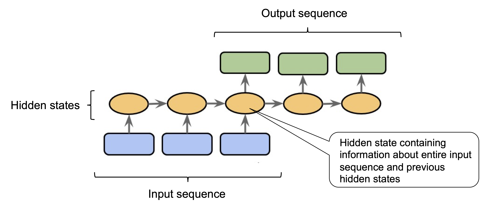
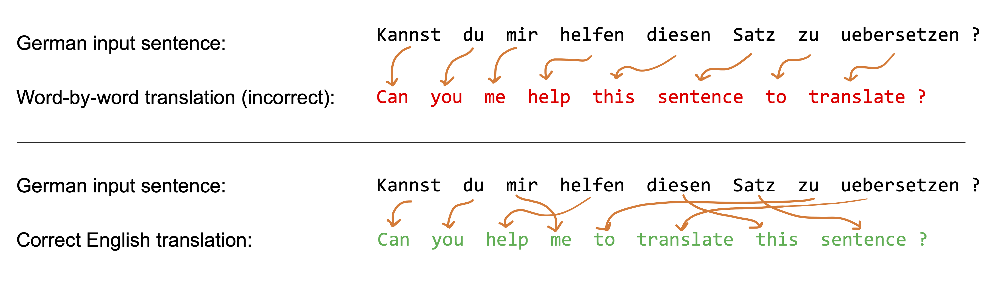
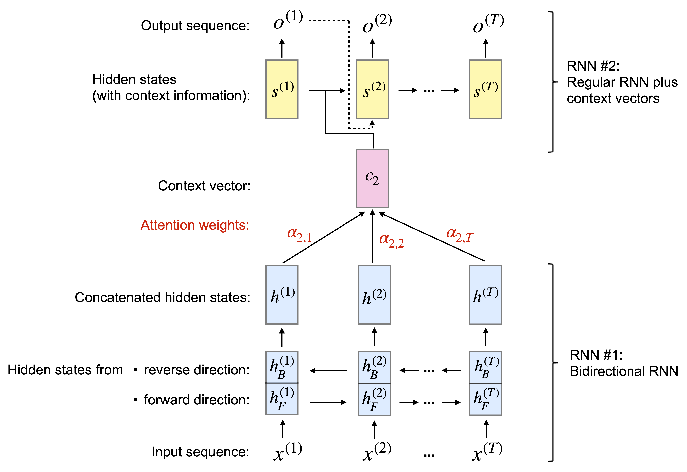
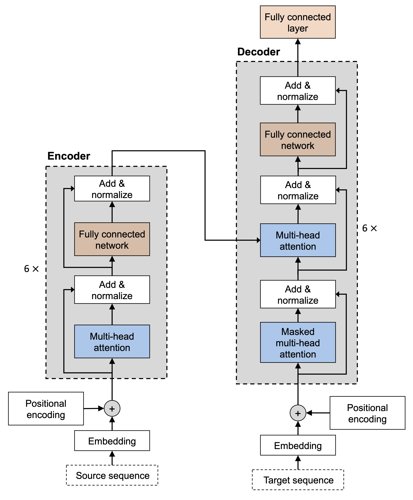

# Transformers: Improving NLP with Attention Mechanisms

## CAP6606: Machine Learning for ISR

### Dr. Brian Jalaian

<div style="text-align: right"><font size="2">1</font></div>
<div style="text-align: right"><font size="2">2</font></div>
<div style="text-align: right"><font size="2">3</font></div>
<div style="text-align: right"><font size="2">4</font></div>
<div style="text-align: right"><font size="2">5</font></div>
<div style="text-align: right"><font size="2">6</font></div>
<div style="text-align: right"><font size="2">7</font></div>
<div style="text-align: right"><font size="2">8</font></div>
<div style="text-align: right"><font size="2">9</font></div>
<div style="text-align: right"><font size="2">10</font></div>
<div style="text-align: right"><font size="2">11</font></div>
<div style="text-align: right"><font size="2">12</font></div>
<div style="text-align: right"><font size="2">13</font></div>
<div style="text-align: right"><font size="2">14</font></div>
<div style="text-align: right"><font size="2">15</font></div>  
<div style="text-align: right"><font size="2">16</font></div>   

---

### Table of Content

- Introduction to Transformers
- Attention Mechanisms
- Self-Attention
- Transformer Architecture
- Pretraining and Finetuning with Large Models
- Finetuning BERT in PyTorch (Lecture Code)

<!-- NOTE: Intro -->
---

## Introduction to Transformers

---

### Challenges & Solutions with Traditional Sequencial Models

| Challenges | Solutions |
|:--------------------------------:|:----------:|
| RNNs/LSTMs struggle with long dependencies | Attention mechanisms |
| Performance degrades with sequence length | Parallel processing |
| Sequential processing limits speed | Direct connections |

---

### Key Innovations in Transformers

- **Architecture:** Replace RNN with self-attention mechanism
- **Modeling:** Direct modeling of all relationships in sequence
- **Benefits:**
  - Parallel training & computation
  - Better handling of long sequences
  - Improved model scalability

<!-- NOTE: Attention Mechanisms-->
---

## Attention Mechanisms

---

### Attention Mechanisms Overview

Seq2Seq models like RNNs process an entire input sequence before producing output.  

However, **compressing all information into one hidden state** may lead to information loss, especially for long sequences. Moreover, using RNN-based Seq2Seq models for translating word by word can lead to grammatical errors.

<p style="text-align:center;">
  
</p>

---

### Why Attention?

Just like humans revisit parts of a sentence while translating, **Attention Mechanism** allows the model to:
- Access all input elements at each time step
- Assign different weights to each element
- Focus on relevant parts

**Example**: To generate "*help*" 

$\rightarrow$ more focus on "*mir, helfen, zu*"
$\rightarrow$ less focus on "*kannst, du, Satz*"

<p style="text-align:center;">
  
</p>

---

### Attention for RNNs

Original paper: **Bahdanau et al., 2014** [*Neural Machine Translation by Jointly Learning to Align and Translate*](https://arxiv.org/abs/1409.0473)

Given input sequence:
$$
x = \left(x^{(1)}, x^{(2)}, \ldots, x^{(T)}\right)
$$

- Attention assigns weight to each input element  
- Helps identify which parts to focus on

For example, suppose our input is a sentence, and a word with a larger weight contributes more to our understanding of the whole sentence. 

---

### Bidirectional RNN Processing

**Bidirectional RNN** reads input sequence: forward $(1 \to T)$ and backward $(T \to 1)$. Thus, each input $x^{(i)}$ has two hidden states: $h_F^{(i)}$ (forward) and $h_B^{(i)}$ (backward). And we can concatenate them: $h^{(i)} = [h_F^{(i)}, h_B^{(i)}]$ for computation efficiency.

<p style="text-align:center;">
  
</p>

---

### Context Vectors

**Context vector $c_i$** is a weighted sum of all hidden states:
$$
c_i = \sum_{j=1}^{T} \alpha_{ij} h^{(j)}
$$

Where $\alpha_{ij}$ is attention weight, and each output has a unique set of $\alpha_{ij}$.

<p style="text-align:center;">
  
</p>

---

### Output Generation

At time step $i$, RNN #2 uses:
- Previous hidden state $s^{(i-1)}$
- Previous target word $y^{(i-1)}$
- Context vector $c^{(i)}$

To generate output $o^{(i)}$  
During **training** $\rightarrow$ feed correct $y^{(i)}$  
During **inference** $\rightarrow$ feed predicted $o^{(i)}$

<p style="text-align:center;">
  
</p>

---

### Computing Attention Weights

Each weight $\alpha_{ij}$ has:
- $j$: index of input
- $i$: index of output

**Normalized alignment score**:
$$
\alpha_{ij} = \frac{\exp(e_{ij})}{\sum_{k=1}^{T} \exp(e_{ik})}
$$

➡️ Similar to **Softmax function**  
➡️ $\sum_{j=1}^{T} \alpha_{ij} = 1$

---

### RNN Attention vs Transformer Attention

**Key difference**:

- **RNN Attention**:
  - Uses attention + recurrent process (one element at a time)

- **Transformer Attention**:
  - Uses **only self-attention**
  - Processes **whole sequence at once**
  - **No recurrence**

<!-- NOTE: Self-Attention -->
---

## Self-Attention

<!-- NOTE: Transformer Architecture -->
---

## Transformer Architecture

<!-- NOTE: Pretraining and Finetuning with Large Models -->
---

## Pretraining and Finetuning with Large Models

<!-- NOTE: Finetuning BERT in PyTorch (Lecture Code) -->
---

## Finetuning BERT in PyTorch (Lecture Code)

---
### The Rise of Attention Mechanisms
- Attention mechanisms originally introduced to improve RNNs.
- Key idea: Focus on important parts of input rather than processing entire sequences.
- Allows dynamic weighting of inputs based on relevance.
- Major breakthrough: Transformer architecture (Vaswani et al., 2017).
- "Attention is All You Need" paper introduced self-attention to replace RNNs.

---
### Adding Attention to RNNs
- Challenge: RNNs suffer from long-range dependencies.
- Solution: Introduce an attention mechanism to access relevant parts of the input.
- The model learns to generate context vectors using attention weights.
- Example: Machine translation and text summarization.
---
### How Attention Works in RNNs??
- Compute context vector for each output token.
- Context vector is a weighted sum of encoder hidden states.
- Weights are computed using:
  - Dot product between current hidden state and encoder states.
  - Softmax function to normalize weights.

---
### Attention Weight Computation
Given encoder hidden states (h₁, h₂, ..., hₙ) and decoder hidden state (d),
attention weights are computed as:

$\alpha_i = \frac{\exp(d \cdot h_i)}{\sum_{j=1}^{n} \exp(d \cdot h_j)}$

Context vector:

$c = \sum_{i=1}^{n} \alpha_i \cdot h_i$

---
### Why Use Attention Mechanisms?
- Allows RNNs to handle longer sequences without losing context.
- Improves performance in tasks like translation and summarization.
- Reduces model complexity by focusing on important inputs.
- Paves the way for the development of the Transformer model.
---
### Self-Attention Mechanism

| From\To | I | like | pizza |
|:----:|:----:|:----:|:----:|
| **I** | 0.7 | 0.2 | 0.1 |
| **like** | 0.3 | 0.3 | 0.4 |
| **pizza** | 0.1 | 0.5 | 0.4 |

**Key Points:**
- Each row: how one word attends to all others
- Row weights sum to 1.0 (probability distribution)
- Higher values = stronger relationships


---
### Key Formula for Self-Attention
Given query (Q), key (K), and value (V) matrices:

$\text{Attention}(Q, K, V) = \text{softmax} \left(\frac{QK^T}{\sqrt{d_k}}\right) V$

Where:
- $d_k$: Dimensionality of keys
- Softmax ensures weights sum to 1.

**Why Scaling?**
- Scaling factor $\sqrt{d_k}$ prevents large dot products.

---
### Self-Attention in Practice

```python
def self_attention(Q, K, V):
    d_k = Q.size(-1)
    scores = torch.matmul(Q, K.transpose(-2, -1)) / torch.sqrt(torch.tensor(d_k, dtype=torch.float32))
    attention_weights = F.softmax(scores, dim=-1)
    context = torch.matmul(attention_weights, V)
    return context, attention_weights

# Example usage with random tensors
Q = torch.randn(1, 3, 4)  # Batch x Seq x Dim
K = torch.randn(1, 3, 4)
V = torch.randn(1, 3, 4)
context, weights = self_attention(Q, K, V)
print("Context:", context)
print("Attention Weights:", weights)
```

---
### RNNs vs Transformers Comparison

| Aspect | RNNs | Transformers |
|:-------|:-----|:-------------|
| Sequences | Sequential processing | Parallel processing |
| Context | Struggles with long inputs | Efficient with attention |
| Speed | Slow (recurrence) | Fast (parallelization) |
| Memory | High for long sequences | Efficient with fixed length |

**Takeaway:** Transformers outperform RNNs in efficiency and accuracy.

---
### Multi-Head Self-Attention

<div style="display: flex; align-items: center;">
<div style="flex: 50%; padding-right: 20px;">

- Breaks the input into multiple heads for parallel processing.
- Each head learns different aspects of word interactions.
- Improves model's capacity to focus on different semantic relations.

</div>
<div style="flex: 50%;">



</div>
</div>

---
### How Multi-Head Attention Works
1. Split the input into multiple attention heads.
2. Perform self-attention independently on each head.
3. Concatenate the outputs and project to the final dimensions.

**Mathematical Formulation:**

$\text{MultiHead}(Q, K, V) = \text{Concat}(\text{head}_1, \ldots, \text{head}_h) W^O$

- Each head:
$\text{head}_i = \text{Attention}(QW_i^Q, KW_i^K, VW_i^V)$
 
---
### Self-Attention Numerical Example
Q = [1 0; 0 1]  
K = [1 0; 0 1]  
V = [1 2; 3 4]

### Calculation
1. Dot product: Q * K^T
2. Apply scaling and softmax.
3. Multiply softmax output by V.

| Q · K^T | Scaling | Softmax  | Context Vector |
|:-------:|:-------:|:--------:|:--------------:|
| 1.0     | 0.707   | 0.62     | 1.86           |
| 0.0     | 0.707   | 0.38     | 2.14           |

---


